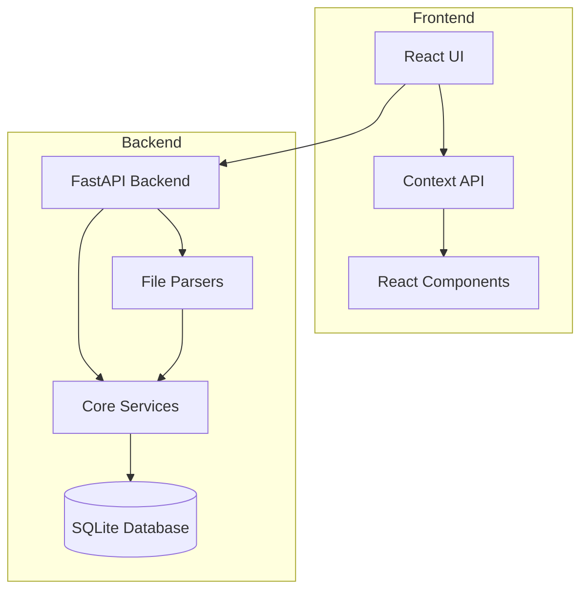
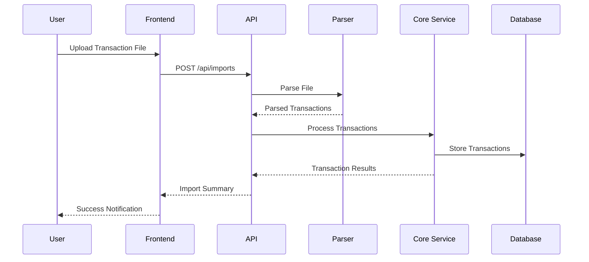
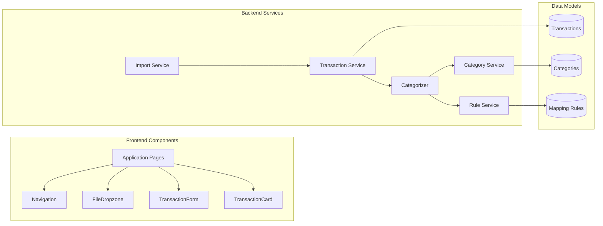
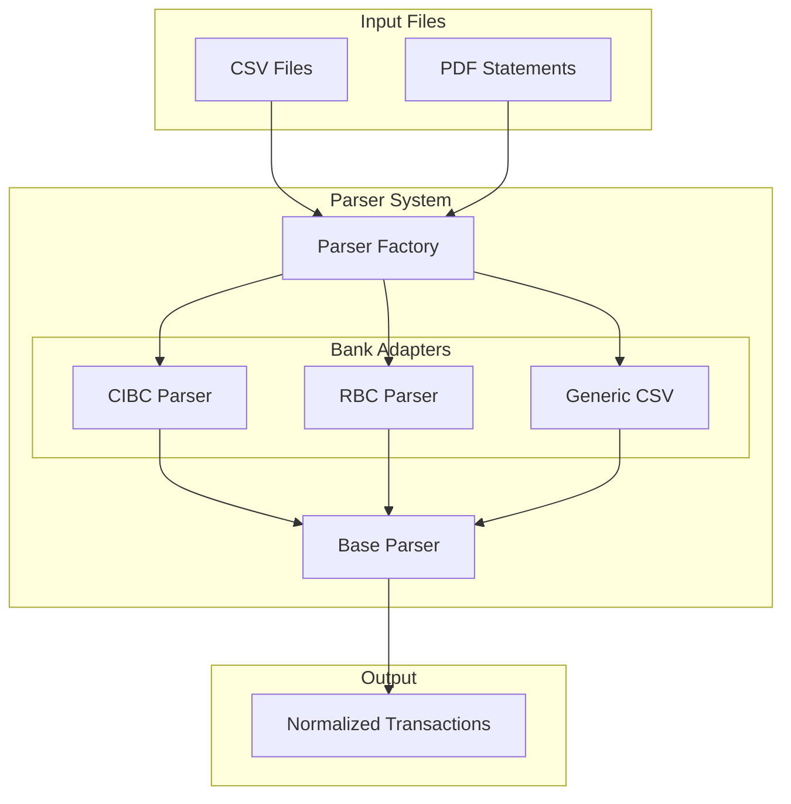

# Geda Budget App

Geda is a budget tracking application that helps you manage your finances by importing transactions, categorizing them automatically, and providing insights into your spending patterns.

## Features

- **Offline Data Import**: Import transactions from CSV files or PDF statements from various banks.
- **Transaction Management**: View, add, edit, and delete transactions.
- **Auto-Categorization**: Automatically categorize transactions based on rules and LLM suggestions.
- **Category Management**: Create and manage custom categories.
- **Spending Analysis**: Visualize spending by category and track spending trends over time.

## Getting Started

### Prerequisites

- Python 3.8 or higher
- Node.js 14.x or higher
- npm or yarn

### Installation

1. Clone the repository
   ```bash
   git clone <repository-url>
   cd geda
   ```

2. Initialize the project using the Makefile
   ```bash
   make init
   ```
   
   This will:
   - Create a virtual environment
   - Install backend dependencies
   - Install frontend dependencies
   - Reset the database

3. Run the complete application (backend API and frontend)
   ```bash
   make run
   ```

   or run them separately:

   ```bash
   # In one terminal - start the backend API
   make backend
   
   # In another terminal - start the frontend
   make frontend
   ```

4. Access the application in your browser at http://localhost:3000
5. API documentation is available at http://localhost:8003/docs

### Available Makefile Commands

Run `make help` to see all available commands:

```
backend              Run the backend server
clean                Clean up generated files
clean-all            Clean everything including dependencies and build artifacts
db-reset             Reset the database
frontend             Run the frontend development server
help                 Show this help message
init                 Initialize the project from scratch (install dependencies and reset DB)
install              Install all dependencies (backend and frontend)
run                  Run both backend and frontend concurrently
setup-backend        Install backend dependencies
setup-frontend       Install frontend dependencies
test                 Run all tests
test-backend         Run backend tests
test-csv             Test CSV import
test-pdf             Test PDF parser
venv                 Create a virtual environment
```

### Testing

You can test the PDF parser functionality with the included sample data:

```bash
python test_pdf_parser.py
```

And you can test the CSV import functionality with:

```bash
python test_csv_import.py
```

## Project Structure

### Backend
- `geda/api/`: API routes and schemas
- `geda/core/`: Core business logic
- `geda/db/`: Database configuration
- `geda/models/`: Database models
- `geda/parsers/`: Import parsers for different file formats
  - `geda/parsers/adapters/`: Adapters for different bank formats

### Frontend
- `frontend/src/components/`: Reusable React components
- `frontend/src/pages/`: Main application pages
- `frontend/src/context/`: React context for state management
- `frontend/src/utils/`: Utility functions
- `frontend/src/assets/`: Static assets like images and icons

## Features Overview

### Dashboard
- Overview of income, expenses, and balance
- Recent transactions
- Spending by category visualization
- Monthly spending trends

### Transactions
- List and filter all transactions
- Add, edit, and delete transactions
- Search and filter functionality

### Import Data
- Drag-and-drop import of CSV and PDF files
- Transaction preview before importing
- Automatic duplicate detection

### Categories
- Default and custom categories
- Category management (create, edit, delete)
- Transaction reassignment when deleting categories

### Analysis
- Detailed spending breakdowns
- Monthly spending trends
- Category analysis with visualizations

## Architecture

### System Overview



### Data Flow



### Component Architecture



### Parser Architecture



## Development

### Contributing

1. Fork the repository
2. Create a feature branch
3. Commit your changes
4. Push to the branch
5. Create a new Pull Request

## License

This project is licensed under the MIT License.